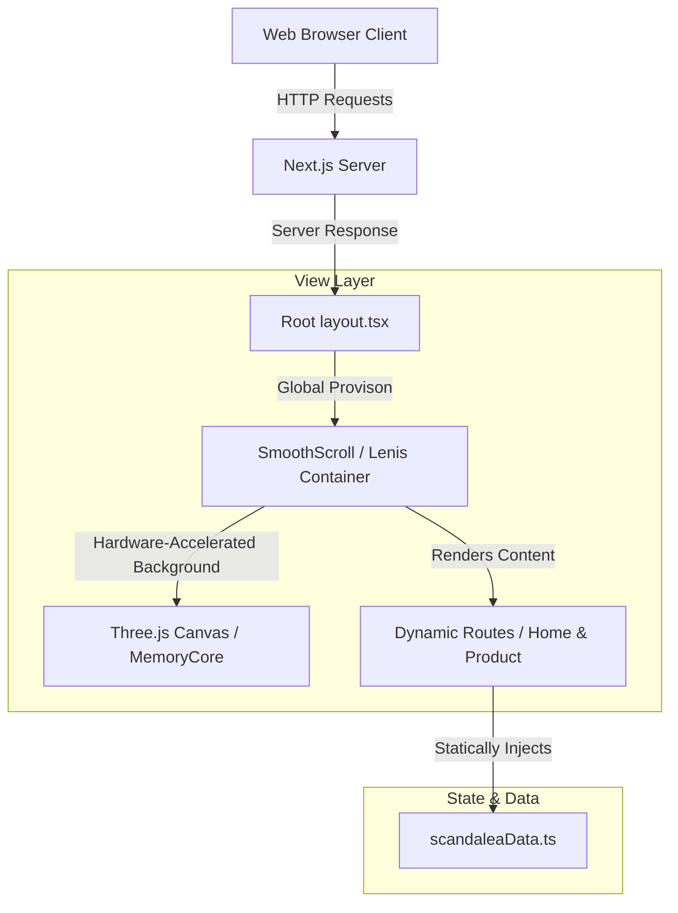

# System Architecture & Technical Specifications

> [!WARNING]
> **DEMONSTRATION ONLY & ARCHIVED STATUS**
> This repository is officially discontinued and exists solely as a technical showcase. It is not maintained and is not intended for real-world production setups.

---

## 🏗️ Architectural Overview

The application is structured as a Next.js 14 (App Router) deployment utilizing React 18, Tailwind CSS, and a specialized WebGL interaction canvas. 

---

## 📦 Key Component Modules

### 1. Global WebGL Interactions (`src/components/canvas/`)
* **Component Path**: [Scene.tsx](file:///home/sezin/Documents/scandalea-main/scandalea-main/src/components/canvas/Scene.tsx) and [MemoryCore.tsx](file:///home/sezin/Documents/scandalea-main/scandalea-main/src/components/canvas/MemoryCore.tsx)
* **Design Pattern**: Serves as a viewport-locked, background canvas element (`position: fixed; inset: 0`). It leverages `@react-three/fiber` instanced mesh rendering to render 2,000 dodecahedrons using a single GPU draw call.
* **Scroll & Cursor Vectors**: A local hook tracks document-wide cursor coordinates and normalizes them (`-1` to `1` range). Swirling parameters are recalculated every frame within the `useFrame` render loop based on both mouse offsets and scroll progress.

### 2. Smooth Scrolling Context
* **Component Path**: [SmoothScroll.tsx](file:///home/sezin/Documents/scandalea-main/scandalea-main/src/components/SmoothScroll.tsx)
* **Goal**: Leverages Lenis to manage virtual scroll events. This prevents browser-native layout thrashing while synchronizing scroll coordinates with GSAP ScrollTrigger timelines.

### 3. GSAP Timeline Management
* **Design Pattern**: Components utilizing GSAP ScrollTrigger must utilize React lifecycle controls wrapper `useGSAP` or wrap timelines in a `gsap.context` cleanup block during layout effects.
* **Memory Protection**: Ensures all ScrollTrigger instances, event listeners, and pinning proxies are automatically garbage-collected upon component unmount, preventing critical memory leaks.

### 4. Static Regeneration
* **Component Path**: [page.tsx](file:///home/sezin/Documents/scandalea-main/scandalea-main/src/app/product/[slug]/page.tsx)
* **Goal**: Since products are defined statically in [scandaleaData.ts](file:///home/sezin/Documents/scandalea-main/scandalea-main/src/constants/scandaleaData.ts), the dynamic product page route `/product/[slug]` implements `generateStaticParams` to pre-compile HTML views for every fragrance at build time, improving initial load speeds and Core Web Vitals (LCP).
